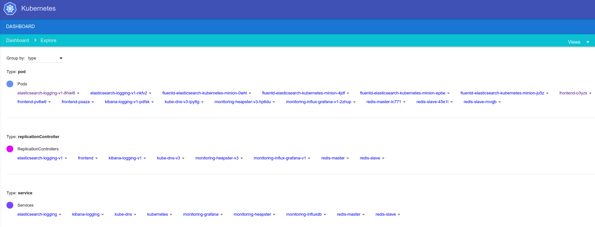
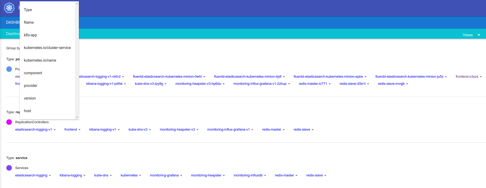

# Kubernetes UI Instructions

## Kubernetes User Interface
Kubernetes has a web-based user interface that displays the current cluster state graphically. 

## Accessing the UI
By default, the Kubernetes UI is deployed remotely as a cluster addon. To access it, visit `/ui` on your master server, which redirects to `/api/v1/proxy/namespaces/kube-system/services/kube-ui/#/dashboard/`.

If the UI cluster addon isn't running, you can start it manually with the following commands.
```shell
cd cluster/addons/kube-ui/image
make kube-ui
make push 
```

## Using the UI
The Kubernetes UI can be used to introspect your current cluster, such as checking how resources are used, or looking at error messages. You cannot, however, use the UI to modify your cluster. 

### Node Resource Usage 
After accessing Kubernetes UI, you'll see a homepage dynamically listing out all nodes in your current cluster, with related information including internal IP addresses, CPU usage, memory usage, and file systems usage. 


### Dashboard Views
Click on the "Views" button in the top-right of the page to see other views available, which include: Explore, Pods, Nodes, Replication Controllers, Services, and Events. 

#### Explore View 
The "Explore" view allows your to see the pods, replication controllers, and services in current cluster easily.  

The "Group by" dropdown list allows you to group these resources by a number of factors, such as type, name, host, etc.

You can also create filters by clicking on the down triangle of any listed resource instances and choose which filters you want to add.

To see more details of each resource instance, simply click on it.  


### Other Views
Other views (Pods, Nodes, Replication Controllers, Services, and Events) simply list information about each type of resource. You can also click on any instance for more details. 


## More Information 
For more information, See the [README](../www/README.md) in the www directory.

[]()
