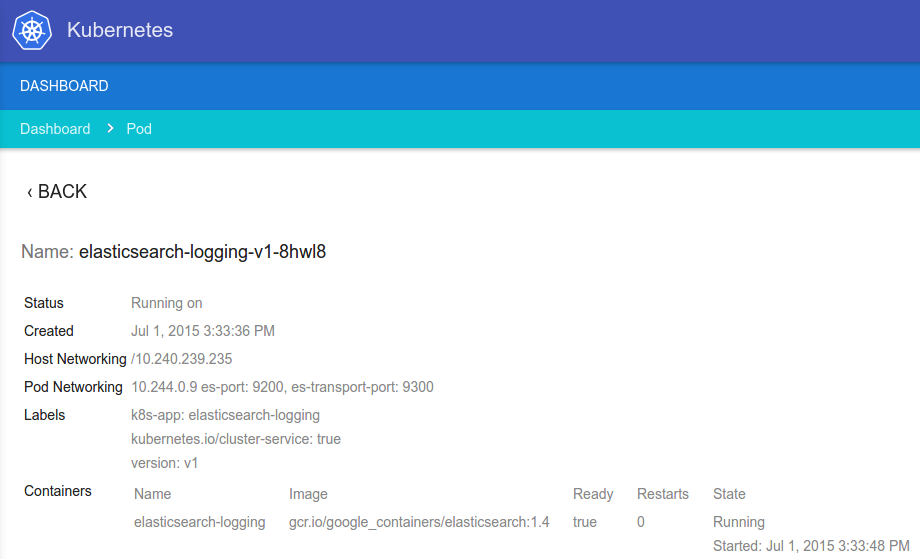

# Kubernetes UI Instructions

## Kubernetes User Interface
Kubernetes has an extensible user interface with default functionality that describes the current cluster. See the [README](../www/README.md) in the www directory for more information.

### Running locally
Assuming that you have a cluster running locally at `localhost:8080`, as described [here](getting-started-guides/locally.md), you can run the UI against it with kubectl:

```sh
kubectl proxy --www=www/app --www-prefix=/
```

You should now be able to access it by visiting [localhost:8001](http://localhost:8001/).

You can also use other web servers to serve the contents of the www/app directory, as described [here](../www/README.md#serving-the-app-during-development).

### Running remotely
When Kubernetes is deployed remotely, the UI is deployed as a cluster addon. To access it, visit `/ui`, which redirects to `/api/v1/proxy/namespaces/default/services/kube-ui/#/dashboard/`, on your master server.

## Using the UI
Kubernetes UI can be used to introspect your current cluster, such as checking how resources are used, or looking at error messages. You cannot, however, use the UI to modify your cluster. 

### Node Resource Usage 
After accessing Kubernetes UI, you'll see a homepage dynamically listing out all nodes in your current cluster, with related information including internal IP addresses, CPU usage, memory usage, and file systems usage. 


### Dashboard Views
Click on "Views" button in the top-right of the page to see other views available, which include: Explore, Pods, Nodes, Replication Controllers, Services, and Events. 

#### Explore View 
The "Explore" view allows your to see the pods, replication controllers, and services in current cluster easily.  

"Group by" dropdown list allows you to group these resources by a number of factors, such as type, name, host, etc.

You can also create filters by clicking on the down triangle of any listed resource instances and choose which filters you want to add.

To see more details of each resource instance, simply click on it.  


### Other Views
Other Views (Pods, Nodes, Replication Controllers, Services, and Events) simply list out related information of each resource. You can also click on any instance for more details. 


[]()
